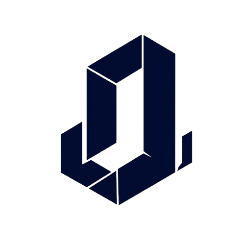

<div align="center">
  
  
  # LexaLink 🏛️✨
  **Platform Riset Hukum Berbasis AI & Manajemen Kepatuhan Terpadu**
  
  [](https://laravel.com)
  [](https://php.net)
  [](https://tailwindcss.com)
  [](https://www.docker.com/)
  [](https://mariadb.org/)
</div>

<br>

## 🚀 Tentang LexaLink

**LexaLink** adalah aplikasi inovatif (_AI Legal Intelligence Platform_) yang dirancang khusus untuk memodernisasi ekosistem hukum, perizinan bisnis, dan kepatuhan korporasi di Indonesia. Platform ini memberikan akses secara _real-time_ ke jutaan dokumen putusan pengadilan dan peraturan perundang-undangan dengan fitur analitik cerdas.

Sebagai pusat dari sebuah **Ecosystem**, LexaLink juga terintegrasi dengan **Perizinankami.id** dan **Salman & Co.** untuk menyediakan solusi layanan satu atap (One-Stop Legal Solution) mulai dari riset, konsultasi, hingga pengurusan legalitas bisnis.

---

## 🌟 Fitur Utama (Core Features)

- 🔍 **Database Peraturan & Putusan:** Pencarian cerdas untuk undang-undang dan putusan pengadilan.
- 🤖 **AI-Driven Insight:** Analisis presisi tinggi berbekal kecerdasan buatan untuk mengulas risiko hukum dan _document review_.
- 🏢 **Kepatuhan & Regulasi Terpadu:** Sistem pemantauan kepatuhan untuk individu dan korporasi.
- 📝 **Legal Drafting & Academy:** Alat pendukung penyusunan dokumen hukum serta event & akademi pelatihan hukum.
- 👥 **Multi-role Dashboard:** Panel manajemen terpisah untuk peran **Admin** dan **Client**.
- 🌓 **Desain Premium UI/UX:** Tampilan eksklusif dengan dukungan fitur _Dark Mode_ dan interaksi _micro-animation_ yang elegan.

---

## 💻 Tech Stack

- **Backend:** Laravel 11.x / PHP 8.2+
- **Frontend:** Blade Templating, Tailwind CSS (Custom Design System), Alpine.js / Vanilla JS
- **Database:** MariaDB / MySQL (or SQLite for light environments)
- **Deployment:** Docker (menggunakan image `serversideup/php:8.2-fpm-nginx`), CasaOS compatible.

---

## 🛠️ Panduan Instalasi (Development)

Pastikan komputer Anda sudah terinstal **PHP 8.2+**, **Composer**, dan **Node.js/NPM**.

1. **Clone repository ini**
    ```bash
    git clone https://github.com/username/lexalink.git
    cd lexalink
    ```
2. **Install Dependensi Backend & Frontend**
    ```bash
    composer install
    npm install && npm run build
    ```
3. **Konfigurasi Environment**
    ```bash
    cp .env.example .env
    php artisan key:generate
    ```
    _(Jangan lupa sesuaikan koneksi database Anda di file `.env`)_
4. **Migrasi Database & Seeding**
    ```bash
    php artisan migrate --seed
    ```
5. **Jalankan Aplikasi**
    ```bash
    php artisan serve
    ```
    Akses di browser melalui: `http://localhost:8000`

---

## 🐳 Panduan Deploy via Docker (Production / CasaOS)

LexaLink sudah dikonfigurasi agar 100% _Docker-ready_ dengan optimasi standar _production_ dari ServerSideUp.

1. **Ubah Konfigurasi di `.env`**
    ```env
    APP_ENV=production
    APP_DEBUG=false
    DB_CONNECTION=mysql
    DB_HOST=db
    ```
2. **Jalankan Docker Compose**
    ```bash
    docker compose up -d
    ```
3. Aplikasi siap diakses di `http://<IP_SERVER_ANDA>:8000`

> 💡 **Info CasaOS:** Jika Anda men-deploy melalui UI Import CasaOS dan terkendala dukungan _multi-container_, ubah konfigurasi `.env` Anda ke `DB_CONNECTION=sqlite`, dan Anda bisa mem-paste container `app` langsung ke form Import CasaOS.

---

## 📸 Tampilan (Screenshots)

**(Anda dapat menaruh screenshot antarmuka aplikasi di sini)**

<details>
  <summary><b>Klik untuk melihat Screenshot</b></summary>
  
  - *Beranda & Navigasi Utama*
  - *Halaman Ecosystem (Grid Card Layout)*
  - *Dashboard Admin & Klien*
  - *Pencarian AI*
  
</details>

---

## 🛡️ Keamanan & Kepatuhan

Infrastruktur dibangun dengan mematuhi standar keamanan akses data terpusat, pengamanan enkripsi sandi via Laravel Hash, dan _middleware_ otentikasi peran yang ketat untuk memastikan **Keamanan Data Terjamin 100%**.

---

<div align="center">
  Dibuat dengan ❤️ oleh <b>benerindisini</b><br>
  © 2026 LexaLink. All rights reserved.
</div>
